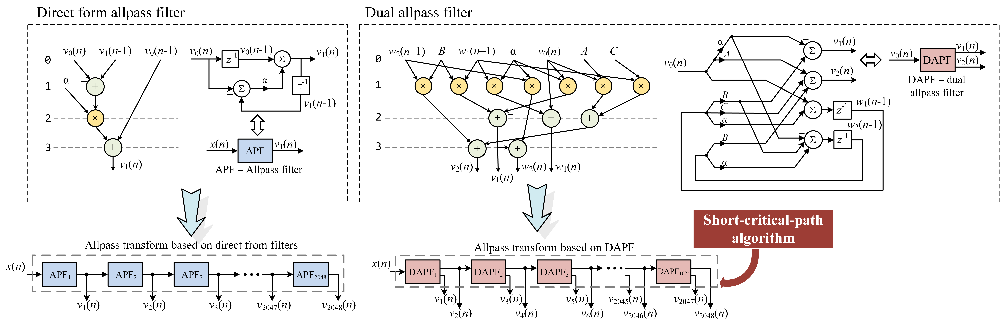

# Short-critical-path algorithm for allpass transform
This repository provides MATLAB and C code of implementation of short-critical-path algorithm for allpass transform.

Short-critical-path algorithm based on usage of dual allpass filters (DAPF) insted of traditional direct form allpass filter. DAPF calculates outputs of cascade of two allpass filters and has the same critical path as direct form allpass filter.



## MATLAB code
Example of MATLAB implementation of short-critical-path allpass transfrom is given in script ``` apc_script.m ``` in ``` matlab ``` folder. File ``` DAPF.m ``` gives implementation of dual allpass filter structure. It is shown that allpass chains based on direct form allpass filter and based in DAPF is completely identical. 

## C code
Software implementation of short-critical-path allpass transfrom that was used for experiments is provided in ``` c_code ``` folder.

## Citation
This research was submitted to Electronics Letters journal. If you use this in your research, please cite the paper:
```
@article{porhun2023,
  title={Short-critical-path algorithm for allpass transform},
  author={Porhun, Maxim and Vashkevich, Maxim},
  journal={Electronics Letters},
  year={2023}
}
```
